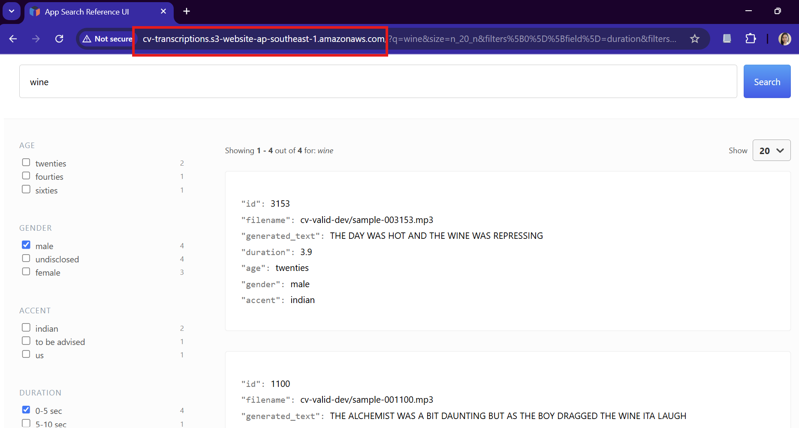
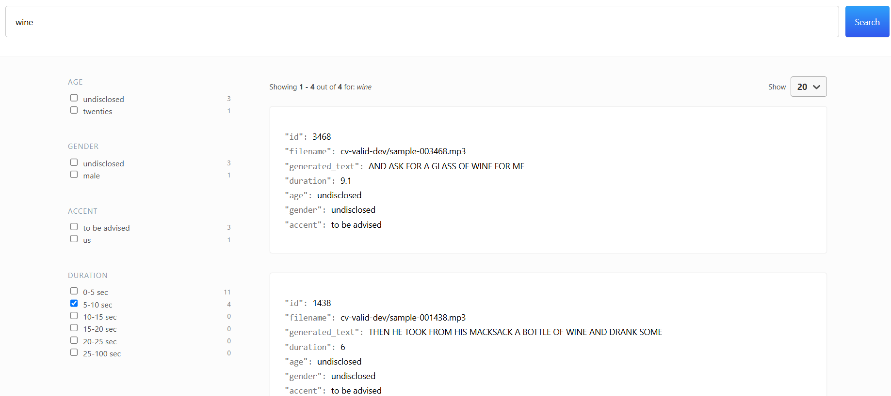

# Deploying Automatic Speech Recognition (ASR) Model to transcribe .mp3 audio files

## Introduction

In this project, I deploy Facebook's wav2vec2-large-90h model (henceforth referred as 'Wav2vec2'), an automatic speech recognition (ASR) model, to transcribe 4,076 .mp3 audio files from the Common Voice Dataset. Note that Wav2vec2 is pretrained and fine-tuned on Librispeech dataset on 16kHz sampled speech audio.


## Main Techstack

Note that for this project, I am using Python 3.11.11

- Basic: Python, CLI, Shell Scripting
- AI/ML Libraries: Transformers, Torch
- Audio: Librosa
- Deployment: FastAPI, Docker, AWS EC2, AWS S3,  
- Testing: PyTest
- Calling API: asyncio, aiohttp, aiofiles, pydantic, pyYaml
- Version Control: git version control

## Overall Directory Structure
```
.
└── asr-submission/
    ├── asr/
    ├── assets/
    ├── deployment-design/
    ├── elastic-backend/
    ├── node_modules/
    ├── search-ui/
    ├── .gitignore
    ├── essay.pdf
    ├── package-lock.json
    ├── README.md
    ├── requirements.txt
    └── run.sh
```

- NOTE: I store paths and .env variables, secrets in separate files rather than hardcoding them into the main script (security purposes)

## Setup

There is a run.sh file at root level, with the options:

1. Create Environment and Install Requirements:
Sets up a Conda environment and installs Python dependencies.

2. Builds and runs a Docker container for the ASR API.
Offers an option to stop and remove the container.

3. Starts Elasticsearch backend services using Docker Compose.
Launches the search UI with Yarn.
Exit:

4. Safely exits the script.

To execute run.sh, simply cd to the root folder ./asr-submission, and run ./run.sh in your bash terminal or equivalent. 

## asr/ directory

```
asr/
├── __init__.py
├── paths.py
├── utility_functions.py
├── conf/
│   ├── config.yml
│   └── openapi.yml
├── cv-valid-dev
├── logs
├── notebooks/
│   └── inference.ipynb
├── tests/
│   ├── __init__.py
│   └── test_utility_functions.py
├── .dockerignore
├── asr_api.py
├── cv-decode.py
├── cv-valid-dev.csv
└── Dockerfile
```

The above shows the structure of the asr/ directory: 
- `paths.py`: Stores directories and filepaths required for asr/ tasks to ensure modularity avoid hardcoding into  scripts
- `utility_functions.py`: Defines helper functions for asr transcription tasks
- `conf/`: Folder contains config files. `config.yml` contains the settings/params for asr transcription tasks; `openapi.yml` defines the API's structure, endpoints, and operations in a standardized format for documentation, testing, and client generation.
- `cv-valid-dev/`: Folder that contains 4,076 .mp3 audio files that will be used for transcription (.gitignore due to size)
- `logs`: Contains logs of running `cv-decode.py` script. folders in logs represent `yyyy-mm-dd` (date where script was run) and individual files are named `hh-mm-ss` (time where script started running). This convention will ensure the logs are organized and makes it easier for user to find their logs. 
- `notebooks/`: Folder contains `inference.ipynb`, which reproduces the inference pipeline tutorial in Wav2Vec2's Hugging Face card. 
- `tests/`: Folder contains `test_utility_functions.py`, which contains tests (PyTest Framework) for functions used in `asr_api.py` and `cv-decode.py`.
- `.dockerignore` : Folders/files that Dockerfile should ignore when containerizing `asr_api.py`.
- `asr_api.py`: FastAPI deployment of the inference pipeline
- `cv-decode.py`: Script that calls FastAPI to transcribe all 4,076 .mp3 files in `cv-valid-dev/`.
- `Dockerfile`: Docker instructions to containerize `asr_api.py`.

### asr_api.py


### cv-decode.py


This is a API microservice which transcribes .mp3 files. To run this select option 2 when executing run.sh. Ensure you have requirements installed beforehand (option 1 in run.sh)

## cv-transcriptions search engine

UPDATED: <br> 
The workaround for this was to change xpack.http.ssl.enabled to false, and the public URL is: 
http://cv-transcriptions.s3-website-ap-southeast-1.amazonaws.com 

However please open it in your <b><u>DESKTOP</b></u> browser. s3 buckets are not https and one way is to 
set up a cloudfront that points to the bucket, however that is not allowed when the ElasticSearch Cluster thats is on EC2 itself is not https enabled. 

Expected result: 




| Errors  | Fixes |
| ------------- | ------------- |
| rpm seems to have trouble, exit code 1  | used tar |
| vm.max_map_count too low | changed to 262144  |
| sudo curl --cacert $ES_HOME/config/certs/http_ca.crt -u elastic:$ELASTIC_PASSWORD https://localhost:9200 error: curl: (77) error setting certificate file: /config/certs/http_ca.crt | chmod -R a+r /home/ec2-user/elasticsearch-8.17.0/config/certs
|search-ui yarn start: fatal alert: certificate unknown | ElasticsearchAPIConnector unable to pass in https ca SHA fingerprint even but elasticsearch.yml enables xpack.security.http.ssl.enabled = true. I tried to refactored App.js code based on official documentation to connect to cluster via javascript: https://www.elastic.co/guide/en/elasticsearch/client/javascript-api/current/client-connecting.html, that did not work. My workaround is to : Disable xpack.security.http.ssl.enabled = true to xpack.security.http.ssl.enabled = false in order to run the website with ElasticsearchAPIConnector. Implications: only use http instead of http now. |


ORIGINAL: <br>

Unfortunately, I was not able to deploy this over a public url as I had issues connecting to the 
cluster that I spun out of the AWS EC2 instance. 
I hypothesize it is a complication arising from enable xpack security, leading to authentication issues.
Here are some of the potential things I would try out if I had more time:
- Spin up a EC2 cluster with a docker-compose.yml without xpack security, then I would have to find a way to migrate the index that I have mounted to my local elastic search cluster.
- Spin up a EC2 cluster directly installing AWS - I have tried to follow their documentation but I believe their instructions to be outdated. 

Nevertheless, I was able to get the intended functions of the search engine running (see photo below): 




If you would like to deploy it locally, take the following steps: 
1. Go to requirements.txt > run pip install on lines 21 and 22
2. Ensure you have the following files in the following directories: 
- ../elastic-backend: edit env.example to .env, place your ca.crt here (refer to ElastiSearch documentation)
- ../search-ui/../config/: edit engine.json.example to engine.json
- ../search-ui/../src/: replace secrets.json.example with your key and change it to secrets.json
- npm install node-modules (ensure you have node-modules installed)
- yarn (ensure you have yarn installed)

Given that you have followed through these steps, you should be able to deploy locally by executing ./run.sh from the root directory and selecting option 3. 
