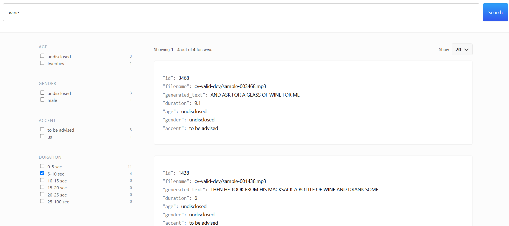

# Deploying Automatic Speech Recognition (ASR) Model to transcribe .mp3 audio files

## Introduction

In this project, I deploy Facebook's wav2vec2-large-90h model (henceforth referred as 'Wav2vec2'), an automatic speech recognition (ASR) model, to transcribe 4,076 .mp3 audio files from the Common Voice Dataset. Note that Wav2vec2 is pretrained and fine-tuned on Librispeech dataset on 16kHz sampled speech audio.


## Techstack

Note that for this project, I am using Python 3.11.11

- Basic: Python, CLI, Git Bash
- AI/ML Libraries: Transformers, Torch
- Audio: Librosa
- Deployment: FastAPI, Docker
- Testing: PyTest
- Others: asyncio, aiohttp, aiofiles, pydantic, pyYaml, git version control


## Directory Structure
```
.
└── asr-submission/
    ├── asr/
    ├── deployment-design/
    ├── elastic-backend/
    ├── node_modules/
    ├── search-ui/
    ├── .gitignore
    ├── essay.pdf
    ├── package-lock.json
    ├── README.md
    ├── requirements.txt
    └── run.sh
```

- NOTE: I store paths and .env variables, secrets in separate files rather than hardcoding them into the main script (security purposes)

## Setup

There is a run.sh file at root level, with the options:

1. Create Environment and Install Requirements:
Sets up a Conda environment and installs Python dependencies.

2. Builds and runs a Docker container for the ASR API.
Offers an option to stop and remove the container.

3. Starts Elasticsearch backend services using Docker Compose.
Launches the search UI with Yarn.
Exit:

4. Safely exits the script.

To execute run.sh, simply cd to the root folder ./asr-submission, and run ./run.sh in your bash terminal or equivalent. 

## asr-api 

This is a API microservice which transcribes .mp3 files. To run this select option 2 when executing run.sh. Ensure you have requirements installed beforehand (option 1 in run.sh)

## cv-transcriptions search engine

Unfortunately, I was not able to deploy this over a public url as I had issues connecting to the 
cluster that I spun out of the AWS EC2 instance. 
I hypothesize it is a complication arising from enable xpack security, leading to authentication issues.
Here are some of the potential things I would try out if I had more time:
- Spin up a EC2 cluster with a docker-compose.yml without xpack security, then I would have to find a way to migrate the index that I have mounted to my local elastic search cluster.
- Spin up a EC2 cluster directly installing AWS - I have tried to follow their documentation but I believe their instructions to be outdated. 

Nevertheless, I was able to get the intended functions of the search engine running (see photo below): 




If you would like to deploy it locally, take the following steps: 
1. Go to requirements.txt > run pip install on lines 21 and 22
2. Ensure you have the following files in the following directories: 
- ../elastic-backend: edit env.example to .env, place your ca.crt here (refer to ElastiSearch documentation)
- ../search-ui/../config/: edit engine.json.example to engine.json
- ../search-ui/../src/: replace secrets.json.example with your key and change it to secrets.json
- npm install node-modules (ensure you have node-modules installed)
- yarn (ensure you have yarn installed)

Given that you have followed through these steps, you should be able to deploy locally by executing ./run.sh from the root directory and selecting option 3. 
